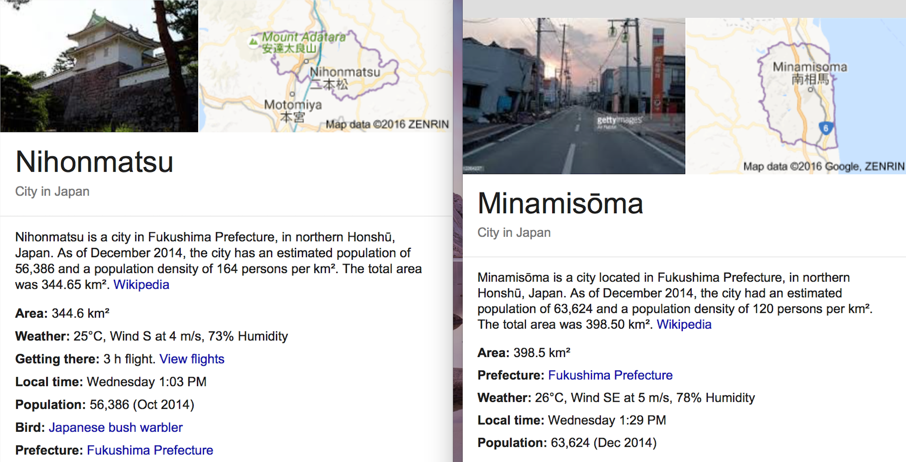

<style type="text/css">

body{ /* Normal  */
   font-size: 12px;
}
td {  /* Table  */
   font-size: 12px;
}
h1 { /* Header 1 */
 font-size: 24px;
 color: DarkBlue;
}
h2 { /* Header 2 */
 font-size: 22px;
 color: DarkBlue;
}
h3 { /* Header 3 */
 font-size: 18px;
 color: DarkBlue;
}
h4 { /* Header 4 */
 font-size: 16px;
 color: DarkBlue;
}
h5 { /* Header 5 */
 font-size: 14px;
 color: DarkBlue;
}
code.r{ /* Code block */
  font-size: 12px;
}
pre { /* Code block */
  font-size: 12px
}
</style>

## DOES POPULATION DENSITY AND LAND USE AFFECT THE RATE OF REDUCTION OF FUKUSHIMA DAICHI RADIATIONS? 

This study uses Nihommatsu city and Mimanisoma City as case studies. The two cities are 70km and 30km from Fukushima Daichi Plant respectively.

<br>



<br>

This research seeks to apply several machine learning algorithms to estimate the rate of reduction of Fukushima Air Dose with respect to variations in population density, land use and distance to Fukushima Nuclear Plant.

**From Linear Model**  $$Y{i} = \beta_{0} + \beta_{1} X_{1i} + \beta_{2} X_{2i} + \beta_{3} X_{1i} X_{2i} + \epsilon_{i}$$
<br>
**Hypothesis**
 $$AvgAirDoseRate = \beta_{0} + \beta_{1} daichi distance + \beta_{2} popn density + \beta_{3} human activities + \beta_{4}(popn density)(human activities) + \epsilon_{i}$$

 **Assumptions**:
<ol>
 <li>The above linear model only looks at 3 parameters hypothesised to affect Air Dose Rate reduction.</li>
 <li>Effect of Air Dose Rate reduction due to the Time series nature of radiations' half life is <b>assumed constant as measured by MEXT.</li>
</ol>

## Part I: Data Loading, Cleaning and Exploring

#### 1.1 Nihomatsu City,70km to Fukushima Daichi

1.11 Required Packages
```{r, error=FALSE,warning=FALSE, message=FALSE}
library("leaflet")
library(readr)
library(dplyr)
library(RColorBrewer)
library(Hmisc)
library(ggplot2)
library(formatR)
```

**NB:Important Notes from the Nuclear Regulation Authority on** [JAEA website](http://emdb.jaea.go.jp/emdb/en/portals/b131/) 

<p>Purposes of this vehicle survey were:</p>
<ol>
<li>To ascertain the tendency and cause of time change of air dose rates by comparing past vehicle survey data and survey meter data at the height of 1 m above ground as well as "walk survey" data, and </li>
<li> To contribute to the establishment of ** radioactive substances distribution prediction model**.
MEXT evaluated the decrease in the air dose rates caused by the decay of cesium during the survey period and it was around 1%, which was smaller than the errors of measuring instruments</li>
[source](http://emdb.jaea.go.jp/emdb/en/portals/b131/)
</ol>
<br>
##### 1.11 Loading June 2011 Fukushima Data and selecting Nihomatsu's.
```{r}
niho <- read_csv("jun_2011_fukushima.csv")
niho2013 <- read_csv("nov_2013_fukushima.csv")
# View(niho2013)
# names(niho)
dim(niho)
# head(niho)
class(niho)
```

##### 1.12 Change to machine readeable column names
```{r, warning = FALSE, message = FALSE,tidy=TRUE, tidy.opts=list(width.cutoff=60)}
names(niho) <- c("gridcode","pref","city","gridCenterNorthlat","gridCenterEastlng","gridCenterNorthlatDec",
                 "gridCenterEastlngDec","daichi_distance","no_samples","AvgAirDoseRate",
                       "NE_nLat","NE_eLong","NW_nLat","NW_eLong",
                       "SW_nLat","SW_eLong","SE_nLat","SE_eLong")
names(niho2013) <- c("gridcode","pref","city","gridCenterNorthlat","gridCenterEastlng","gridCenterNorthlatDec",
                     "gridCenterEastlngDec","daichi_distance","no_samples","AvgAirDoseRate",
                     "NE_nLat","NE_eLong","NW_nLat","NW_eLong",
                     "SW_nLat","SW_eLong","SE_nLat","SE_eLong")
#Strip Nihommatsu city,
niho$city[niho$city == "Nihommatsu city"] <- "nihommatsu"
niho2013$city[niho2013$city == "Nihommatsu city"] <- "nihommatsu"
```

##### 1.13 Filter nihommatsu observations
```{r}
nihom <- subset(niho, city == "nihommatsu")
nihom2013 <- subset(niho2013, city == "nihommatsu")
dim(nihom)
dim(nihom2013)
class(nihom)
```

##### 1.14 Create air dose quantiles that are plot-able,i.e 6 categorical variables.
```{r,tidy=TRUE, tidy.opts=list(width.cutoff=60)}
niho_q <- nihom %>%
        mutate(dose_quants = cut2(nihom$AvgAirDoseRate,
                                  cuts=c(0.1,0.5,1.0,1.5,2.0,2.5,3.0),
                                  levels.mean=TRUE))
niho_q <- na.omit(niho_q)
# write_csv(niho_q, path = "niho_q.csv")
nihom2013_q <- nihom2013 %>%
        mutate(dose_quants = cut2(nihom2013$AvgAirDoseRate,cuts=seq(0.06,1.6,0.25),levels.mean=TRUE))
summary(nihom2013$AvgAirDoseRate)
summary(niho_q$AvgAirDoseRate)
```

<ul>
 <li>Visible reduction of Average Air Dose Distribution by half  in Nihomatsu.</li>
 <li>Trouble is knowing the distribution of causes of this reduction?</li>
</ul>

##### 1.15 Color function
```{r,tidy=TRUE, tidy.opts=list(width.cutoff=60)}
iro <- colorFactor(
        palette = "YlOrRd",
        domain = niho_q$dose_quants
)
iro2013 <- colorFactor(
        palette = "YlOrRd",
        domain = nihom2013_q$dose_quants
)
# Link of Daichi
fukulink <- paste(sep = "<br/>",
                  "<br><a href='http://www.tepco.co.jp
                  /en/decommision/index-e.html'>Fukushima Daichi</a></b>",
                  "Source of radiations")
```

##### 1.16 Nihomatsu Average Air Dose Rate for 2011
```{r, warning = FALSE, message = FALSE,tidy=TRUE, tidy.opts=list(width.cutoff=60)}
niho_plot <- leaflet() %>%
        addTiles()%>%
        addRectangles(data = niho_q,lng1 = ~SW_eLong, lat1 = ~SW_nLat,
                      lng2 = ~NE_eLong, lat2 = ~NE_nLat,
                      color = ~iro(niho_q$dose_quants))%>%
        addLegend("bottomright", pal = iro, values = niho_q$dose_quants,
                  title = "AvgAirDoseRate",
                  labFormat = labelFormat(prefix = "µSv/h "),
                  opacity = 1)%>%
        addPopups(lat = 37.4211, lng = 141.0328,popup = fukulink,
                  options = popupOptions(closeButton = TRUE)) 
niho_plot
```
<br>

##### 1.17 Nihomatsu Average Air Dose Rate for 2013
```{r, warning = FALSE, message = FALSE}
niho2013_plot <- leaflet() %>%
        addTiles()%>%
        addRectangles(data = nihom2013_q,lng1 = ~SW_eLong, lat1 = ~SW_nLat,
                      lng2 = ~NE_eLong, lat2 = ~NE_nLat,
                      color = ~iro2013(nihom2013_q$dose_quants))%>%
        addLegend("bottomright", pal = iro2013, values = nihom2013_q$dose_quants,
                  title = "AvgAirDoseRate",
                  labFormat = labelFormat(prefix = "µSv/h "),
                  opacity = 1)%>%
        addPopups(lat = 37.4211, lng = 141.0328,popup = fukulink,
                  options = popupOptions(closeButton = TRUE)) 
niho2013_plot
```
<br>

##### 1.18 Nihommatsu 2011, Counts of Measuring Locations per Air Dose Rate
```{r, warning = FALSE, message = FALSE}
ggplot(niho_q, aes(daichi_distance,AvgAirDoseRate)) +
        geom_point() +
        geom_smooth(se = FALSE)+
        ggtitle("AvgAirDose against Distance to Daichi Plant")
```

##### 1.19 Nihommatsu 2011,Counts of Measuring Locations per Air Dose Rate 
```{r, warning = FALSE, message = FALSE}
ggplot(data = niho_q) +
        geom_bar(mapping = aes(x = daichi_distance, fill = dose_quants), width = 1)+
        ggtitle("AvgAirDose Measured Counts against Daichi Distance")
```

#### 1.2 Minamisoma City, 30km to Fukushima Daichi
```{r, warning = FALSE, message = FALSE}
mina <- read_csv("niho.csv")
dim(mina)
```

##### 1.21 Change to machine readeable column names
```{r, warning = FALSE, message = FALSE}
#change Minamisoma city to minamisoma
mina$city[mina$city == "Minamisoma city"] <- "minamisoma"
#filter nihomatsu observations only
mina <- subset(mina, city == "minamisoma")
dim(mina)
summary(mina$AvgAirDoseRate)
```

##### 1.22 Create air dose quantiles that are plot-able,6 categorical variables.
```{r, warning = FALSE, message = FALSE,tidy=TRUE, tidy.opts=list(width.cutoff=60)}
mina_q <- mina %>%
        mutate(mina_quants = cut2(mina$AvgAirDoseRate,cuts=seq(0.2,20,2.2),levels.mean=TRUE))
mina_q <- na.omit(mina_q) #remove NAs
write_csv(mina_q, path = "mina_q.csv")
```

##### 1.23 Color function
```{r, warning = FALSE, message = FALSE}
mina_iro <- colorFactor(
        palette = "Set1",
        domain = mina_q$mina_quants
)
```

##### 1.24 Minamisoma Average Air Dose Rate for 2011
```{r,warning = FALSE, message = FALSE,tidy=TRUE, tidy.opts=list(width.cutoff=60)}
mina_plot <- leaflet() %>%
        addTiles()%>%
        addRectangles(data = mina_q,lng1 = ~SW_eLong, lat1 = ~SW_nLat,
                      lng2 = ~NE_eLong, lat2 = ~NE_nLat,
                      color = ~mina_iro(mina_q$mina_quants))%>%
        addLegend("bottomright", pal = mina_iro, values = mina_q$mina_quants,
                  title = "AvgAirDoseRate",
                  labFormat = labelFormat(prefix = "µSv/h "),
                  opacity = 1)%>%
        addPopups(lat = 37.4211, lng = 141.0328,popup = fukulink,
                  options = popupOptions(closeButton = TRUE)) 
mina_plot
```

<br>

##### 1.25 Minamisoma AvgAirDose against Distance to Daichi Plant
```{r, warning = FALSE, message = FALSE}
ggplot(mina_q, aes(daichi_distance,AvgAirDoseRate)) +
        geom_point() +
        geom_smooth(se = FALSE)+
        ggtitle("AvgAirDose against Distance to Daichi Plant")
```

##### 1.26 Minamisoma 2011, Counts of Measuring Locations per Air Dose Rate
```{r, warning = FALSE, message = FALSE}
ggplot(data = mina_q) +
        geom_bar(mapping = aes(x = daichi_distance, fill = mina_quants), width = 1)+
        ggtitle("Counts of Measuring Locations per Air Dose Rate")
```

## PART II: Calculating the Coefficient of Air Dose Reduction

#### 2.00 Merging 2011 and 2013 Nihomatsu Data Sets
```{r, warning = FALSE, message = FALSE,tidy=TRUE,fig.width=6, fig.height=4}
library(ggplot2)
niho_q <- read_csv("niho_q.csv")
niho2013_q <- read_csv("niho2013.csv")
names(niho_q) <- c("gridcode","pref","city","gridCenterNorthlat","gridCenterEastlng",
                   "gridCenterNorthlatDec","gridCenterEastlngDec","daichi_distance",
                   "no_samples","AvgAirDoseRate2011","NE_nLat","NE_eLong","NW_nLat","NW_eLong",
                   "SW_nLat","SW_eLong","SE_nLat","SE_eLong")
names(niho2013_q) <- c("gridcode","pref","city","gridCenterNorthlat","gridCenterEastlng",
                       "gridCenterNorthlatDec","gridCenterEastlngDec","daichi_distance",
                       "no_samples","AvgAirDoseRate2013","NE_nLat","NE_eLong","NW_nLat","NW_eLong",
                     "SW_nLat","SW_eLong","SE_nLat","SE_eLong")
niho11_13 <- merge(niho_q, niho2013_q, by.x = "gridcode", by.y = "gridcode", all = TRUE)
# Check if the merged columns are real identical
niho11_13 <- na.omit(niho11_13)
identical(niho11_13$gridCenterNorthlat.x,niho11_13$gridCenterNorthlat.y)
identical(niho11_13$daichi_distance.x,niho11_13$daichi_distance.y)
identical(niho11_13$no_samples.x,niho11_13$no_samples.y) #2011 and 2013 samples differ

niho11_13 <- select(niho11_13,gridcode,pref.x,city.x,gridCenterNorthlat.x,
                    gridCenterEastlng.x,gridCenterNorthlatDec.x,
                 gridCenterEastlngDec.x,daichi_distance.x,no_samples.x,AvgAirDoseRate2011,
                       NE_nLat.x,NE_eLong.x,NW_nLat.x,NW_eLong.x,no_samples.y,AvgAirDoseRate2013)
# create new data set (niho11_13)
write_csv(niho11_13,path = "niho11_13.csv")
niho11_13 <- read_csv("niho11_13.csv")
#Compare AvgAirDoseRate of 2011&2013
plot(x=niho11_13$AvgAirDoseRate2011,type="l",col="red",ylab = "Avg Air Dose Rate",
     xlab = "Frequency of measuring",main = "Compare AvgAirDoseRate of 2011&2013 Nihomatsu")
lines(niho11_13$AvgAirDoseRate2013,col="green")
legend("topright", legend = c("AvgAirDoseRate2011","AvgAirDoseRate2013"))
```

#### 2.10 Air Dose Rate Reduction due to Distance to Fukushima Daichi 

$$AvgAirDoseRate = \beta_{0} + \beta_{1} daichi distance + \epsilon_{i}$$

```{r, warning = FALSE, message = FALSE}
fit1 <- lm(AvgAirDoseRate2013~daichi_distance.x, data = niho11_13)
summary(fit1)
#Confidence interval
confint(fit1)
```


#### 2.20 Air Dose Rate Reduction due to Population Density and Land Use

$$AvgAirDoseRate = \beta_{0} + \beta_{1} popn density + \beta_{2} human activities + \epsilon_{i}$$

**Challenge**
<p> The Air Dose Rate measurements were collected from three sources: </p>
<ol>
 <li>Cars and Buses with Sensors: Measure Air of 100sq meters from the road</li>
 <li>Un manned Auto Helicopter: Measure from 300m above ground</li>
 <li>Fixed Sensors: Geographically sparsed </li>
</ol>

<p> What constitutes Land Use?: </p>
<ol>
 <li>Farming: Short life span crops lead to frequent land tilling</li>
 <li>Cleaned Places: Parks, GolfCourses, Gardens are cleaned too and could reduce radiations</li>
<br>
</ol>
<p> Population density and land usage is measured on a 500m&#0178; basis</p>

#### 2.30 Using other machine learning algorithms

<p> The Fukushima Nuclear Radiations is multi dimensional;</p>
<li> *Three major Isotopes each with;*</li>
<li> Time series due to half life </li>
<li> Magnitude of radiation (Becquerel) </li>
<li> Absorbed dose (Sievert (Sv)) </li>
<p> The above dimensionalities coupled with distance,population density and land use, create a data set that can be run on extensive machine learning algorithms like Support Vector Machines, Random Forest, Recurrent Neural Networks and more.</p>

**end**


